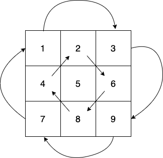

[48. Rotate Image](https://leetcode.com/problems/rotate-image/) - <span style="color: #f7a43e; font-weight: bold">Medium</span>

## Description

!!! abstract "48. Rotate Image"

    You are given an n x n 2D matrix representing an image, rotate the image by 90 degrees (clockwise).

    You have to rotate the image in-place, which means you have to modify the input 2D matrix directly. DO NOT allocate another 2D matrix and do the rotation.

    **Example 1**:

    

    > **Input**: matrix = [[1,2,3],[4,5,6],[7,8,9]]
    >
    > **Output**: [[7,4,1],[8,5,2],[9,6,3]]

题目上的图已经很明显了，就是讲一个矩阵顺时针旋转90度。

## Solution

给大家看一个图，就能更直观的感受到旋转时发生的变化了：



以上图举例，旋转操作的流程大致为(以`(0, 0)`坐标的旋转举例)：`(0, 0)`上的值变到`(0, 2)`，`(0, 2)`上的值变化到`(2, 2)`，`(2, 2)`上的值旋转到`(2, 0)`，最后`(2, 0)`上的值旋转到`(0, 0)`。

很容易就能看出来是有规律的，每个坐标都需要旋转到对应的下一个坐标，`(i, j)`需要旋转到的坐标为`(j, n - i - 1)`。而在下一个坐标处继续往当前坐标的下一个坐标旋转，这样循环4次，一定就会把当前坐标以及对应的下一个坐标的值全部旋转完。

而我们只用关心每一行中 `(start ～ end)` 的索引，其中`start = [0 ~ n / 2]`每一行增加1，`end = [n - 2, start)`，废话不多说，直接看代码。

代码还有待优化的地方，有些循环是没有必要的。

```java
class Solution {
    int n;
    public void rotate(int[][] matrix) {
        n = matrix.length;
        int start = 0, end = n;
        for (int i = 0; i < n; i++) {
            for (int j = start; j < end - 1; j++) {
                rotate(matrix, i, j);
            }
            start++;
            end--;
        }
    }
    
    private void rotate(int[][] matrix, int i, int j) {
        int swap = -1001;
        for (int m = 0; m < 4; m++) {
            if (swap == -1001) {
                swap = matrix[i][j];
                matrix[i][j] = matrix[n - 1 - j][i];
            } else {
                int tmp = swap;
                swap = matrix[i][j];
                matrix[i][j] = tmp;
            }
            int tmp = i;
            i = j;
            j = n - tmp - 1;
        }
    }
}
```
