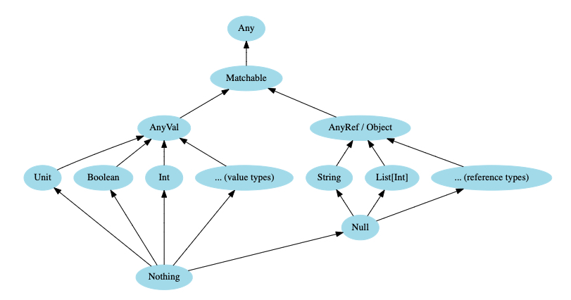

*Scala* 同时拥有**面向对象**和**函数式**编程的特性，是一个 **high-level** 编程语言。并且它能运行在 **JVM**、**JavaScript** 和 **Native LLVM** 上。因为其高性能，所以被广泛的运用于大数据处理的应用程序中。

目前 *Scala* 有两个版本：2.13.8 和 3.1.8

因为 Scala 是能够运行在 JVM 上的，所以可以无缝使用 Java 的各种 API。

## Scala Ecosystem

Scala has a vibrant ecosystem, with libraries and frameworks for every need. The [“Awesome Scala” list](https://github.com/lauris/awesome-scala) provides a list of hundreds of open source projects that are available to Scala developers, and the [Scaladex](https://index.scala-lang.org/) provides a searchable index of Scala libraries. Some of the more notable libraries are listed below.

### Web development

* The [Play Framework](https://www.playframework.com/) followed the Ruby on Rails model to become a lightweight, stateless, developer-friendly, web-friendly architecture for highly-scalable applications
* [Scalatra](https://scalatra.org/) is a tiny, high-performance, async web framework, inspired by Sinatra
* [Finatra](https://twitter.github.io/finatra) is Scala services built on TwitterServer and Finagle
* [Scala.js](https://www.scala-js.org/) is a strongly-typed replacement for JavaScript that provides a safer way to build robust front-end web applications
* [ScalaJs-React](https://github.com/japgolly/scalajs-react) lifts Facebook’s React library into Scala.js, and endeavours to make it as type-safe and Scala-friendly as possible
* [Lagom](https://www.lagomframework.com/) is a microservices framework that helps you decompose your legacy monolith and build, test, and deploy entire systems of Reactive microservices

#### HTTP(S) Libraries

* Akka-http
* Finch
* Http4s
* Sttp

#### JSON Libraries

* Argonaut
* Circe
* Json4s
* Play-JSON

#### Serialization

* ScalaPB

### Science and data analysis

* Algebird
* Spire
* Squants

### Big Data

* Apache Spark
* Apache Flink

### AI, Machine Learning

* BigDL (Distributed Deep Learning Framework for Apache Spark) for Apache Spark
* TensorFlow Scala

### Functional Programming & Functional Reactive Programming

**FP**:
* Cats
* Zio

**Functional reactive programming (FRP)**:
* fs2
* monix

### Build Tools

* sbt
* Gradle
* Mill

## Hello World

In scala, all types inherits from top-level class `Any`, whose immediate children is `AnyVal` and `AnyRef`.

Look following code block, `def` is a keyword to declare a method, the method `hello` is declared to be a "main" method with `@main` annotation.

`Unit` 

```scala
@main def hello = println("Hello World!)

// If your method doesn't return any value(like Java void), you can use Unit for method return type
declare world(): Unit = println("Hello World!")
```

Compile and Run:

```shell
# compile Hello.scala
scalac Hello.scala

# run main method of Hello.scala
scala hello
```

## Variables and Types



### Variables

There are two types of variables:

* **val**: Creates a **immutable** variable - like `final` in Java. Good practice: always create a variable with `val`, unless you have reason to use a mutable variable.
* **var**: Creates a mutable variable. Only used for a variable will change over time.

Example:

```scala
// immutable
val a = 0

// mutable
val b = 1
```

If you try to assign a new value to immutable variable, there will be a compile error.

### Declaring variable with types

| Data Type | Possible Values |
|:----------|:----------------|
|Boolean|`true` or `false`|
|Byte|8-bit signed two’s complement integer (-2^7 to 2^7-1, inclusive): -128 to 127|
|Short|16-bit signed two’s complement integer (-2^15 to 2^15-1, inclusive): -32,768 to 32,767|
|Int|32-bit two’s complement integer (-2^31 to 2^31-1, inclusive): -2,147,483,648 to 2,147,483,647|
|Long|64-bit two’s complement integer (-2^63 to 2^63-1, inclusive): (-2^63 to 2^63-1, inclusive)|
|Float|32-bit IEEE 754 single-precision float: 1.40129846432481707e-45 to 3.40282346638528860e+38|
|Double|64-bit IEEE 754 double-precision float: 4.94065645841246544e-324 to 1.79769313486231570e+308|
|Char|16-bit unsigned Unicode character (0 to 2^16-1, inclusive): 0 to 65,535|
|String|a sequence of `Char`|


```scala
val l: Long = 1
val b: Byte = 1
val s: Short = 1
val f: Float = 1.1
```

**Built-in data types**:

* Byte
* Int
* Long
* Short
* Double
* Float

`Int` and `Double` are the default numeric types, you should create them without explicitly declaring the data type:

```
val n = 100 // defaults to Int
val d = 1.12 // defaults to Double
```

You can also append `L`, `D`, `F` to numbers to specify their type:

```scala
val l = 1_000L
val d = 1.12D
val f = 1.2F
```

Big numbers:

* BigInt
* BigDecimal

```scala
val a = BigInt(1_234_567_890_987_654_321L)
val b = BigDecimal(123_456.789)
```

`String` and `Char`:

```scala
val s = "Billy"
val c = 'a'
```

### Strings

You can use Strings variables in a string formatter:

```scala
val firstName = "Torres"
val lastName = "Ray"

println(s"Name: $firstName $lastName")
```

### Multiline strings

```scala
val quote = """Hello:
                World"""
```

### Type Casting

```scala
val l: Long = 987654321
val f: Float = l // 9.8765434E8 (some precision is lost in this case)

val face: Char = '☺'
val n: Int = face // 9786
```

### Nothing and Null

`Nothing` is a subtype of all types, **bottom type**. No value that has the type `Nothing`. Common use is to signal non-termination, eg. a thrown exception, program exit...

`Null` is also a subtype of all reference types (i.e. any subtypeof `AnyRef`).

## Control Structures

### if/else

```scala
// scala 3 syntax
if {condition1} then
    //statement1
else if {condition2} then
    // statement2
else
    // statement3

// scala 2 syntax
if ({condition1}) {
    // statement1
} else if ({condition2}) {
    // statement2
} else {
    // statement3
}
```

Ternary Expression:

```scala
val x = if a < b then a else b
```

### for loops and expression

#### for loops

```scala
// scala 3 syntax
val ints = List(1,2,3,4,5)
for i <- ints do println(i)

// scala 2 syntax
for (i <- ints) println(i)
```

`for` with *guards*:

```scala
for
    i <- ints
    if i > 2
do
    println(i)
```

#### for expression

Use `yield` keyword instead of `do`, you can create `for` *expressions* which are used to calculate and yield results.

```scala
val ints = List(1, 2, 3, 4, 5)
val doubled = for i <- ints yield i * 2

println(doubled) // List(2, 4, 6, 8, 10)
```

You can also write the code like this:

```scala
val doubled = for i <- ints yield i * 2     // style shown above
val doubled = for (i <- ints) yield i * 2
val doubled = for (i <- ints) yield (i * 2)
val doubled = for { i <- ints } yield (i * 2)
```

### match expressions

`match` keyword is like Java `switch` statement:

```scala
val i = 1
i match
  case 1 => println("one")
  case 2 => println("two")
  case _ => println("others")

val result = i match
  case 1 => println("one")
  case 2 => println("two")
  case _ => println("others")
```

### try/catch/finally

```scala
try
  writeTextToFile(test)
catch
  case ioe: IOException => println("Got an IOException")
  case nfe: NumberFormatException => println("Got an NumberFormatException")
finally
  println("Clean up your resources here")
```

### while loops

```scala
while x >= 0 do x = f(x)
```

## OOP Domain Modeling

### Traits

`traits` is like `interface` in Java, but it can also contain abstract and concrete methods and fields, and they can have parameters, just like classes.

```scala
trait Animal(name: String) {

  def bark(): String
  def sleep(): Unit = println("Ozzzz......")
  def eat(): Unit = println(s"$name is eating...")

}

class Dog(var name: String) extends Animal(name) { // var means the field name is mutable
  override def bark(): String = "Woof!"
}

@main def main(): Unit = {
    val dog: Dog = new Dog("Ermeng")
    dog.eat() // print "Ermeng is eating..."
}
```

`class` can have multiple extends `trait`, also we can use `override` to override a method from a extended trait.

### Classes

`class` in Scala is pretty similar to Java classes.

```scala
class Person(var firstName: String, var lastName: String):
    def getFullName(): String = s"$firstName $lastName"

val p: Person = new Person("Torres", "Lei)
println(p.firstName)
println(p.getFullName())
```

### Enums

For example, a pizza has three main attributes:

```scala
enum CrustSize:
  case Small, Medium, Large
enum CrustType:
  case Thin, Thick, Regular
enum Topping:
  case Cheese, Pepperoni, BlackOlives, GreenOlives, Onions
```

How to use them:

```scala
import CrustSize.*
val currentCrustSize = Small

currentCrustSize match
  case Small => println("Small crust size")
  case Medium => println("Medium crust size")
  case Large => println("Large crust size")

if currentCrustSize == Small then println("Small crust size")
```

### Case classes

`case` class is a kind of class (has all functionality of a `class`) which the fields in it are immutable. Some additional features:

* Case class constructor parameters are public `val` fields by default, so the fields are immutable and accessor methods of each parameter are generated.
* `unapply` method is generated in `case` class (Use in `match` expressions).
* A `copy` method is generated in the class.
* `equals` and `hashcode` methods are generated to implement structural equality.
* A default `toString` method is generated.

Example:

```scala
case class Person (
    name: String,
    vocation: String
)

val p = Person("Torres Lei", "Programmer")

p // default toString method: Person(Torres Lei,Programmer)

p.name = "Another Name" // Compile Error

val p2 = p.copy(role = "Software Engineer") // Person(Torres Lei, Software Engineer)
```

## Methods

```scala
def methodName(param1: Type1, param2: Type2): ReturnType = 
    // method body

def sum(a: Int, b: Int): Int = a + b

// also you can remove return type
def sum(a: Int, b: Int) = a + b
```

**Named Parameter** and **Default Parameter Value**:

```scala
def makeConnection(url: String, timeout: Int = 5000): Unit =
  println(s"url = $url, timeout = $timeout")

// without named parameters
makeConnection("http://localhost", "2500")

// Named Parameters
makeConnection(url = "http://localhost", timeout = 2000)
```

## Extension Methods

*Extension Methods* let you add new methods to closed classes. For instance, if you want to add two methods named `hello` and `aloha` to `String` class, decalre them as extension methods:

```scala
extension (a: Animal)
  def sitDown(): Unit = println(s"Hi ${a.getName}")

val dog: Dog = Dog("Golden Retriever")
dog.sitDown() // print "Sit Down! Golden Retriever"
```

## First-Class Functions

Scala has most features you'd expect in a functional programming language:

* Lambda
* Higher-order functions (HOFs)
* Immutable collections in the standard library

### Lambda

`map` method for `List` class:

```
val l = List(1, 2, 3, 4, 5)
val b = l.map(i => i * 2) // List(2, 4, 6, 8, 10)
val c = l.map(_ * 2) // List(2, 4, 6, 8, 10)
```

Also has method reference:

```scala
def double(i: Int): Int = i * 2

val l = List(1, 2, 3)

val a = l.map(i => double(i))
val b = l.map(double) // method reference in Java
```

### Immutable collections

```scala
val nums = (1 to 10).toList // List(1, 2, 3, 4, 5, 6, 7, 8, 9, 10)
val x = nums.filter(_ > 3)
            .filter(_ < 7)
            .map(_ * 10)
// result: x == List(40, 50, 60)
```

### Create methods take function as parameter

```
def sum(a: Int, b: Int): Int = a + b

def calculate(f: (Int, Int) => Int, i: Int, j: Int): Int = f(i, j)

// sum is a function declared above
println(calculate(sum, 4, 7)) // print 11
```

## Object

`object` in Scala creates a *singleton* object, which means, `object` defines a class that has exactly one instance.

**Common Usage**:

* Used to create a collection of utility methods.

```s
object StringUtils:
  def isNullOrEmpty(str: String): Boolean => str == null || s.trim.isEmpty

val res1 = StringUtils.isNullOrEmpty("   ") // true
val res2 = StringUtils.isNullOrEmptu("aa") // false
```

* Companion object.

```scala
import scala.math.*
class Circle(radius: Double) {

  def area: Double = calcaulateSize(this.radius)
}

object Circle {
  private def calculateSize(radius: Double): Double =>
    Pi * pow(radius, 2.0)
}

@main def main(): Unit = {
  val circle = new Circle(4.0D)
  println(circle.area) // 50.26548245743669
}
```
`object Circle` is companion object, and `class Circle` is companion class.


* Implement traits to create modules.

```scala
trait AddService:
  def add(a: Int, b: Int): Int = a + b

trait MultiplyService:
  def multiply(a: Int, b: Int): Int = a * b

object MathService extends AddService, MultiplyService

@main def main(): Unit = {
  println(MathService.add(4, 5))
  println(MathService.multiply(5, 6))
}
```


