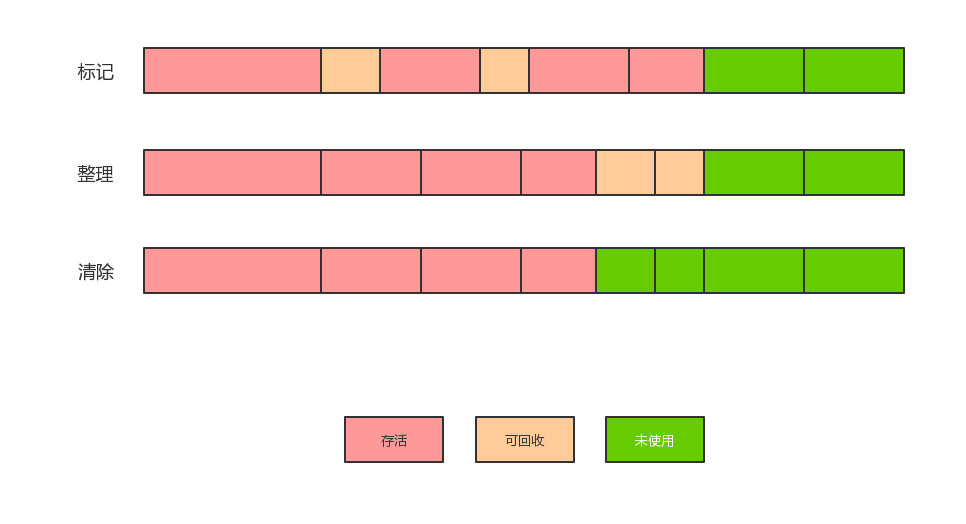
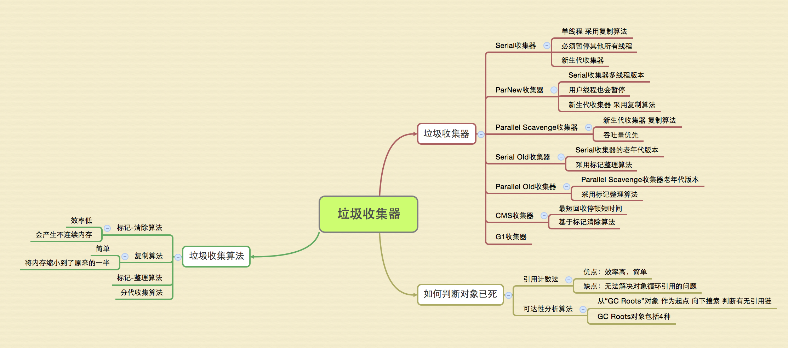

关于 Java 回收的文章大同小异，我将我查阅的各种资料整合了一下，取文章中写的好的部分以及自我总结，写出这篇文章。

## Java 堆空间的基本结构


上图的 Eden 区和 Survivor From 区、Survivor To 区都属于新生代，Tenured 区属于老年代，在大部分情况，对象首先会在 Eden 区域分配，在第一次新生代垃圾回收（Minor GC）后，如果对象还存活，则该对象会进入 Survivor To 区，并且年龄会加1（第一次从 Eden 到 Survivor 区时年龄是1），当年龄到达一定程度时（默认为 15 岁，但是不一定必须到达 15 岁才会进入老年代区），对象会被晋升到老年代中，对象晋升到老年代的年龄阀值，可以通过设置参数 `-XX:MaxTenuringThreshold` 来控制。经过这次 GC 之后，Eden 区 和 From 区已经被清空，这时候，From 和 To 会交换他们的角色，也就是说此时新的 Survivor To 区就是 GC 之前的 Survivor From 区，新的 Survivor From 区就是 GC 之前的 Survivor To 区。Minor GC 会一直重复这个过程，直到 Survivor To 区被填满，To 区被填满之后，会将所有对象移动到老年代中。

**堆内存常见的分配策略：**

- 对象优先分配在 Eden 区
- 大对象直接进入老年代
- 长期存活的对象将进入老年代

## Java 垃圾收集算法

### 标记 - 清除算法

该算法首先标记出需要回收的对象，在标记完成后统一回收所有被标记的对象。该算法是垃圾回收最基础的算法，后续的算法都是对其不足进行改进得到的。它会带来两个很明显的问题：

- **效率问题**
- **空间浪费问题（标记清除后会产生大量不连续的碎片，导致大量空间无法使用）**


### 复制算法

将堆内存分为大小相同的两块，每次只使用一块。这块内存使用完后，将还存活的对象复制到另一块内存中，然后把使用的空间一次全部清理，这样每次回收都只对内存的一半进行回收。

这样也会有一定的问题，就好比我们买了200平的房子，却只能使用100平，这就造成了使用空间的缩小。


### 标记 - 整理算法

针对老年代特点特出的一种标记算法，过程与“标记 - 清除”算法一样，但是标记之后不是直接对可回收对象进行回收，而是让所有存活对象向一端移动，然后清理掉存活对象端边界以外的内存。



### 分代收集算法

!!! question

    问题：HotSpot 为什么要分为新生代和老年代？

根据对象存活周期的不同将内存分为几块（一般将 Java 堆分为新生代和老年代），这样就可以根据各年代的特点来选择合适的垃圾收集算法。

比如在新生代中，每次垃圾收集都会有大量的对象死去，所以我们可以选择复制算法，只需要付出少量对象的复制成本则可以完成每次垃圾收集。而老年代中对象的存活几率都是比较高的，而且没有额外的空间对它进行分配担保，所以我们必须选择 “标记 - 清除” 或者 “标记 - 整理” 算法进行垃圾收集。

## 垃圾收集器

图片来源：[读书笔记—深入理解Java虚拟机1](https://yemengying.com/2015/11/12/读书笔记-深入理解Java虚拟机1/)



### 新生代串行收集器 - Serial

串行收集器主要有两个特点：1、使用单线程进行垃圾回收；2、独占式的垃圾回收。

在串行收集器进行垃圾回收时，Java 应用程序中的线程都需要暂停，等待垃圾回收完成，这样就会造成较差的用户体验。但是串行收集器仍然是一个成熟的、经过长时间生产环境考验的极为高效的收集器。

新生代串行收集器采用**复制算法**，实现相对简单，并且没有线程切换的开销。在 HotSpot 虚拟机中，使用 `-XX:+UseSerialGC` 参数可以指定新生代串行收集器和老年代串行收集器。当 JVM 在 Client 模式下运行时，默认使用新生代串行收集器。一次新生代串行收集器的工作输出日志类似于下（使用 `-XX:PrintGCDetails` 开关）：

```java
[GC [DefNew: 3468K->150K(9216K), 0.0028638 secs][Tenured:
  1562K->1712K(10240K), 0.0084220 secs] 3468K->1712K(19456K),
  [Perm : 377K->377K(12288K)],
  0.0113816 secs] [Times: user=0.02 sys=0.00, real=0.01 secs]
```

它显示了垃圾回收之前新生代的占用内存和垃圾回收后的占用内存，以及垃圾回收的时间。

### 新生代并行收集器 - ParNew

它是新生代串行收集器的多线程版本，垃圾回收时也会暂停 Java 应用程序的线程。它除了使用多线程处理垃圾回收外，其他的功能与 Serial 收集器一样。在单 CPU 的环境下，ParNew 收集器的表现不会比 Serial 更优秀。

### Parallel Scavenge 收集器

Parallel Scavenge 收集器也是使用复制算法的多线程垃圾收集器，它看上去几乎和 ParNer 一模一样。**但是 Parallel Scavenge 收集器的关注点是吞吐量（高效率的利用 CPU），吞吐量就是 CPU 中用于运行用户代码的时间与 CPU 总消耗时间的比值。而 CMS 等垃圾收集器关注的更多的是用户线程的停顿时间，提高用户体验。**Parallel Scavenge 收集器提供了很多参数供用户找到最适合的停顿时间或最大的吞吐量。

```bash
-XX:UseParallelGC  // 使用 Parrallel 收集器（新生代），老年代使用串行收集器
-XX:UseParallelOldGC  // 使用 Parallel 收集器，老年代并行
```

**此收集器中，新生代采用复制算法，老年代采用“标记-整理”算法**

### 老年代串行收集器 - Serial Old

老年代串行收集器是 Serial 收集器的老年代版本，同样是单线程，但是它使用**标记-整理算法**。他也是一个串行的、独占式的垃圾回收器。由于老年代垃圾回收通常会使用比新生代垃圾回收更长的时间，因此，在堆空间较大的应用程序中，一旦老年代串行收集器启动，应用程序很可能会因此停顿几秒甚至更长时间。但是Serial Old 收集器可以和多种新生代收集器配合使用，而且可以作为 CMS 收集器的备用收集器。可以通过参数 `-XX:+UseSerialGC` 将新生代和老年代都使用串行收集器，使用 `-XX:UseParallelOldGC` 设置新生代和老年代都使用并行收集器。

### Parallel Old 收集器

**Parallel Scavenge 收集器的老年代版本。**该收集器采用”标记-整理“算法。注重吞吐量以及 CPU 资源的场合，都可以优先考虑 Parallel Scavenge 和 Parallel Old 收集器。

### CMS 收集器

**CMS (Concurrent Mark Sweep)** 收集器是一种以**获取最短回收停顿时间**为目标的收集器，它非常符合网站或者 B/S 系统的服务端上的 Java 应用等重视响应速度的场景。从名字上可以看出，它是基于 “标记-清除”算法实现的。

CMS 收集器的整个工作流程为以下 4 个步骤：

- **初始标记**：暂停所有其他线程，标记 GC Roots 能直接关联的对象，速度很快。
- **并发标记**：同时开启 GC 线程和用户线程，用闭包结构去记录可达对象。但是这个阶段结束后，并不能保证这个闭包包含所有的可达对象，因为用户线程可能同时会更新引用域，所以 GC 线程无法保证可达性分析的实时性。所以这个阶段就是 GC Roots Tracing 过程，记录发生引用更新的地方。
- **重新标记**：修正并发标记期间发生引用变化的那一部分对象。这一阶段的停顿时间会比初始标记阶段的时间稍长，但远远比并发标记的时间短。
- **并发清除**：开启用户线程，同时 GC 线程对未标记的区域进行清除。


优点：并发，低停顿

缺点：

1、当次收集无法处理并发标记时用户线程产生的新的垃圾。

2、因为使用 “标记-清除” 算法，所以会产生很多内存空间碎片，导致当前堆中老年代空间有剩余，但是无法找到足够大的连续空间来分配当前对象，这样会提前触发一次 Full GC。

#### CMS 垃圾收集器的优化

`-XX:ParallelCMSThreads`：手动设置 CMS 的线程数量。CMS 默认启动的线程是 `(ParallelGCThreads+3)/4)` ，其中 ParallelGCThreads 是新生代并行收集器的线程数量。

`-XX:CMSInitiatingOccupancyFraction`：CMS 收集器进行垃圾回收的阀值（当前堆内存的使用率阀值），默认为 68，也就是说当堆内存的使用率达到 68% 时，会执行一次 CMS 回收。**如果应用程序内内存增长很快，在 CMS 执行过程中，已经出现了内存不足的情况（用户线程会并行执行），就会导致 CMS 回收失败，JVM 将启动老年代串行收集器进行垃圾回收。这样会造成线程的停顿，影响用户体验，这时可以将 `-XX:CMSInitiatingOccupancyFraction` 调小。如果应用程序的内存增长缓慢的话，可以适当调大这个阀值，可以有效的降低 CMS 的触发频率**

`-XX:+UseCMSCompactAtFullCollection`：因为 CMS 采用 “标记-清除” 算法，会造成大量内存碎片，这样会导致无法分配较大的对象，而触发 Full GC，这很影响系统性能。**设置此参数可以使 CMS 在垃圾收集完成后，进行一次内存碎片整理（内存碎片整理不是并发进行的）。可以使用 `-XX:CMSFullGCsBeforeCompaction` 参数来设定进行多少次 CMS 回收后，进行一次内存压缩。**

### G1 收集器

**G1 GC 是 JDK 7 的新特性之一**，它的目标是作为一款服务器的垃圾收集器。所以它在吞吐量和停顿控制上，都要优于 CMS。

> 以下引用自 [JVM 七种垃圾收集器](http://wuzhangyang.com/2019/01/17/java-garbage-collector/#)

G1 (Garbage First) 的各代存储地址是不连续的，每一代都使用了 n 个不连续的大小相同的 region， 每个 region 占有一块连续的虚拟内存地址。


G1 跟踪各个 Region 里面的垃圾堆积的价值大小（回收所获得的空间大小以及回收所需时间的经验值），在后台维护一个优先列表，每次根据允许的收集时间，优先回收价值最大的 Region。

#### 避免全堆扫描

多个 Region 之前的对象可能会有引用关系，在做可达性分析时需要扫描整个堆才能保证准确性，这显然降低了 GC 效率。

为避免全堆扫描，虚拟机为 G1 中每个 Region 维护了一个与之对应的 Remembered Set。虚拟机发现程序在对Reference类型的数据进行写操作时，会产生一个Write Barrier 暂时中断写操作，检查 Reference 引用的对象是否处于不同的 Region 之中（在分代的例子中就是检查是否老年代中的对象引用了新生代中的对象），如果是，便通过 CardTable **把相关引用信息记录到被引用对象所属的Region的 Remembered Set 之中**。当进行内存回收时，在GC根节点的枚举范围中加入 Remembered Set 即可保证不对全堆扫描也不会有遗漏。

#### G1 的运作步骤

- 初始标记（Initial Marking）
- 并发标记（Concurrent Marking）
- 最终标记（Final Marking）
- 筛选回收（Live Data Counting and Evacuation）


#### 特点

- 空间整合：整体来看是基于“标记 - 整理”算法实现的收集器，从局部（两个 Region 之间）上来看是基于“复制”算法实现的，这意味着运行期间不会产生内存空间碎片。
- 可预测的停顿：能让使用者明确指定在一个长度为 M 毫秒的时间片段内，消耗在 GC 上的时间不得超过 N 毫秒。

> 以上引用自 [JVM 七种垃圾收集器](http://wuzhangyang.com/2019/01/17/java-garbage-collector/#)

## GC 相关参数设置

可以适当使用这些参数对 GC 进行调优。

1、输出 GC 日志

```java
-XX:+PrintGCDetails        // 输出 GC 日志
-XX:+DisableExplicitGC        // 禁用显示 GC
```

2、串行 GC 相关设置

```java
-XX:+UseSerialGC        // 指定新生代和老年代都使用串行收集器（Client模式默认值）
-XX:+SurvivorRatio        // 设置 eden 区大小和 survivor 区大小的比例，默认为8
-XX:+PretenureSizeThreshold        // 设置大对象直接进入老年代的阈值。当对象的大小超过这个值时，将直接在老年代分配。
-XX:MaxTenuringThreshold        // 设置对象进入老年代的年龄的最大值。每一次 Minor GC 后，对象年龄就加 1。任何大于这个年龄的对象，一定会进入老年代。
```

3、并行 GC 参数设置

```java
-XX:+UseParNewGC        // 使用 ParNew + Serial Old 组合进行垃圾回收（不推荐）
-XX:+UseParallelGC        // 使用 Parallel Scavenge 和 Serial Old 组合进行回收
-XX:+UseParallelOldGC        // Parallel Scavenge + Parallel Old 收集组合进行垃圾回收
-XX:ParallelGCThreads        //并行收集器工作时的线程数量，在 CPU 数量小于8个时，ParallelGCThreads等于 CPU 数量；如果大于8个，ParalellGCThreads 的值等于 3+[5*CPU_Count]/8]；
-XX:+MaxGCPauseMills        // 设置最大垃圾收集停顿时间
-XX:+GCTimeRatio        // 设置吞吐量大小（0 - 100之间的整数）垃圾收集时间不会超过 1/(1+n) 
-XX:+UseAdaptiveSizePolicy        // 打开自适应 GC 策略
```

4、CMS 收集器相关参数设置

```java
-XX:+UseConcMarkSweepGC        // 新生代使用并行收集器，老年代使用 CMS + 串行收集器
-XX:ParallelCMSThreads        // 手动设定 CMS 的线程数量
-XX:CMSInitiatingOccupancyFraction        // CMS 回收触发阀值（当前堆内存的使用率）默认为68（68%）
-XX:+UseCMSCompactAtFullCollection        // CMS 垃圾回收完成后，进行一次内存碎片整理
-XX:CMSFullGCsBeforeCompaction        // 多少次 CMS 垃圾回收后，进行一次内存整理（压缩）
-XX:+CMSClassUnloadingEnabled        // 允许对类元数据进行回收
-XX:+CMSParallelRemarkEndable        // 启用并行重标记
-XX:CMSInitatingPermOccupancyFraction        // 当永久区占用率达到这一百分比后，启动 CMS 回收（需要开启 -                                                                                    XX:+CMSClassUnloadingEnabled）
-XX:UseCMSInitatingOccupancyOnly        // 只有到达阀值的时候，才进行 CMS 回收
-XX:+CMSIncrementalMode        // 使用增量模式，适用于单 CPU
```

5、G1 收集器相关参数设置参数

```java
-XX:+UseG1GC        // 使用 G1 收集器
-XX:+UnlockExperimentalVMOptions        // 允许使用实验性参数
-XX:+MaxGCPauseMills        // 设置垃圾收集最大停顿时间
-XX:+GCPauseIntervalMills        // 设置停顿间隔时间
```

基于对 JVM 垃圾回收器的工作原理以及程序设计的了解，希望大家都能找出适合自己的最优优化方案。

## 对于几个问题的解答

### 对象死亡的判断

堆中几乎存放着所有的实例对象，所以要了解垃圾回收器，首先要学会判断哪些对象已经死亡（不能再使用）。

JVM 有两种方法判断对象是否死亡：

- **引用计数法**

给对象添加一个引用计数器，如果有一个地方引用它，计数器就加1，引用失效时，计数器减1。计数器值为0的对象就是不能再使用的。

这种方法实现简单，效率高，但是目前主流的虚拟机没有再使用这种方法了，因为它无法解决对象之间相互引用的的问题。

- **可达性分析法**

此算法的基本思想就是通过一系列的称为 “GC Roots” 的对象作为起点，从这些节点开始向下搜索，借点娑走过的路径叫做引用链，当一个对象到 GC Roots 没有任何引用链相连的话，就说明此对象是不可用的。

### Minor GC 和 Full GC 的区别

- 新生代 GC（Minor GC）：发生在新生代的垃圾收集操作，Minor GC 非常频繁，且一般速度也比较快。
- Major GC / Full GC：发生在老年代的 GC，速度一般比 Minor GC 慢10倍以上。

### 其他问题

- Java 四种引用类型 ～ 强引用，软引用，弱引用，虚引用（虚引用与软引用和弱引用的区别，使用软引用的好处）
- 如何判断一个常量是废弃常量
- 如何判断一个类是无用的类

## 总结

来源于 [JVM 七种垃圾收集器](http://wuzhangyang.com/2019/01/17/java-garbage-collector/)

| 收集器                | 串行、并行or并发 | 新生代/老年代 | 算法               | 目标         | 适用场景                                  |
| :-------------------- | :--------------- | :------------ | :----------------- | :----------- | :---------------------------------------- |
| **Serial**            | 串行             | 新生代        | 复制算法           | 响应速度优先 | 单CPU环境下的Client模式                   |
| **Serial Old**        | 串行             | 老年代        | 标记-整理          | 响应速度优先 | 单CPU环境下的Client模式、CMS的后备预案    |
| **ParNew**            | 并行             | 新生代        | 复制算法           | 响应速度优先 | 多CPU环境时在Server模式下与CMS配合        |
| **Parallel Scavenge** | 并行             | 新生代        | 复制算法           | 吞吐量优先   | 在后台运算而不需要太多交互的任务          |
| **Parallel Old**      | 并行             | 老年代        | 标记-整理          | 吞吐量优先   | 在后台运算而不需要太多交互的任务          |
| **CMS**               | 并发             | 老年代        | 标记-清除          | 响应速度优先 | 集中在互联网站或B/S系统服务端上的Java应用 |
| **G1**                | 并发             | both          | 标记-整理+复制算法 | 响应速度优先 | 面向服务端应用                            |

[参考链接]

- [Java Garbage Collection Basics](https://www.oracle.com/webfolder/technetwork/tutorials/obe/java/gc01/index.html)
- [JVM Garbage Collectors](https://www.baeldung.com/jvm-garbage-collectors)
- [Java Garbage Collection Algorithms](https://howtodoinjava.com/java/garbage-collection/all-garbage-collection-algorithms/)
- [SnailClimb JavaGuide - Java垃圾回收](https://github.com/Snailclimb/JavaGuide/blob/master/docs/java/jvm/JVM垃圾回收.md)
- [JVM 垃圾回收器工作原理及使用实例介绍](https://www.ibm.com/developerworks/cn/java/j-lo-JVMGarbageCollection/index.html)
- [JVM 七种垃圾收集器](http://wuzhangyang.com/2019/01/17/java-garbage-collector/)
