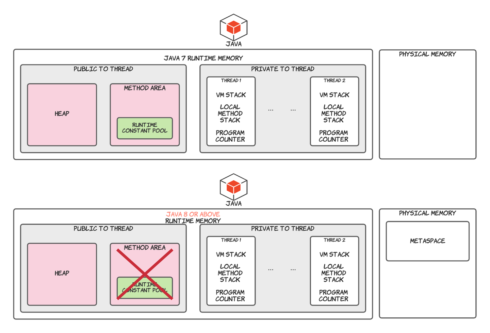

## Purpose

这篇文章是用来记录 Java 面试时需要应对的 Java 虚拟机部分的问题。

## Java 7 到 Java 8 的更新

[JEP 122: Remove the Permanent Generation](http://openjdk.java.net/jeps/122)

在此文章中出现了这段话：

!!! info

    The proposed implementation will allocate class meta-data in native memory and move interned Strings and class statics to the Java heap. 
    Hotspot will explicitly allocate and free the native memory for the class meta-data.

这次提出的实现会将类的元数据分配在本地内存中，并将 interned Strings 和类静态数据移入 Java 堆中。

之前使用 `-XX:MaxPermSize` 来控制 Permanent Generation 的内存大小，现在可以使用 `-XX:MaxMetaspaceSize` 控制元空间的最大值了。

## Java 虚拟机内存区域

Java 7 和 Java 8 有两种不同的内存区域，我会将他们分开说明。

JVM 内存区域中还有一个特殊的部分，叫做 Code Cache (代码缓存)，code cache 是 JVM 用来存储 native code。它是位于连续内存块块上的单个堆数据结构。

!!! note

    这个就涉及到 Tiered Compilation 了，可以自行去看文档：[Java Virtual Machine Guide ](https://docs.oracle.com/en/java/javase/11/vm/java-hotspot-virtual-machine-performance-enhancements.html)

## Run-Time Data Areas - 运行时数据区

JVM 定义了各种各样在程序执行中使用的运行时数据区。一些是在 JVM 启动时创建并且只在 JVM 关闭时销毁，另外一些则是根据每个线程，线程的数据区是在线程创建时创建并在线程执行完毕时销毁。

### The PC Register - 程序计数器寄存器

!!! tip

    pc stands for program counter, so pc register equals to program counter register. 下文都将简称 pc register 为 程序计数器

JVM 支持同一时间许多线程的执行。每个 JVM 线程都有它自己的 pc 注册器。任何时间点线程都在执行单个方法的代码，如果这个方法不是 native 方法，则当前线程的程序计数器包含现在正在执行的 JVM 指令的地址。 而如果正在执行 native 方法，则该线程的程序计数器的值就是 undefined。（程序计数器足以保存特定平台上的 returnAddress 或 native 指针。）

### Java Virtual Machine Stacks - JVM 栈

每个线程都有个私有的栈空间，在线程创建时创建。栈空间是用来储存栈帧（frames）的。JVM 的堆栈类似于传统语言（eg. C）的堆栈：保存了本地变量和部分返回值，并在方法调用和返回中起到作用。因为 JVM 栈空间除了弹出 (pop) 和压入 (push) 栈帧不会被直接操作，所以栈帧可能是在堆中分配的。所以 JVM 栈的内存不需要是连续的。

以上规范允许 JVM 栈拥有固定大小或者根据计算要求动态扩展和收缩。如果栈是固定大小，那么在创建栈的时候可以独立选择栈的大小。

> JVM 给程序员和用户提供了控制 JVM 栈初始化大小的功能，以及在动态扩展或收缩栈空间的情况下，指定最大和最小值。

但是 JVM 栈也有一些例外情况（异常）：

- 如果说计算要求的栈空间比允许使用的空间还要大，JVM 会抛出一个 StackOverflowError 异常。

- 如果栈空间可以动态扩展，但是没有足够的内存空间来实现扩展，或者没有足够的内存来为新的线程创建栈空间，则 JVM 会抛出`OutOfMemoryError`。

### Heap - 堆

堆在 JVM 中是线程共享的，是给所有**类实例**和**数组**分配空间的运行时数据区。

堆是在 JVM 启动时创建的。

存储在堆中的对象由 **GC**（Garbage Collector, automatic storage management system） 回收。所以我们在 Java 中**不会显式**释放对象的内存。

堆可以是固定大小或者动态扩展或者当大堆没有必要的时候收缩。

堆的内存不需要连续。

> JVM 也给开发者提供了控制堆内存大小的参数
>
> -Xms size 设定堆内存最小值和初始值
>
> -Xmx size 指定对内存最大值
>
> -Xmn size 指定对内存中年轻代的初始值和最大值

如果给对象分配内存时，堆内存不足了，JVM 会抛出`OutOfMemoryError`。

在堆中，我们分出了两个部分：nursery (可称作年轻代 - young generation) 和 old space (老年代)。其中 nursery memory 又被氛围三个部分：一个 Eden memory 和两个 survivor memory (s0, s1)。绝大多数新创建的对象都被分配在 Eden Memory 中，当 Eden Memory 满了时，Minor GC 会将所有 eden memory 中的对象移到 survivor memory 中 (通常其中由很大一部分会被回收，未被回收的部分会移到 survivor 中)，并且 Minor GC 会检查 survivor 中的对象并将它们 (未被回收的部分) 移到另一个 survivor memory 中，所以在同一个时间点，会有一个 survivor memory 是空的。当对象在 survivor 中存活足够多的 cycle 后，会被移入 老年代内存中。

> 需要注意的是，Java HotSpot VM 在启动的时候，会在地址空间预留整个 Heap，但除非需要，否则不会为其分配物理内存。

### Method Area - 方法区（Java 8 之后已经移除）

Java 8 之后已经移除了 Permanent Generation，方法区是 Java 虚拟机的逻辑概念。而在 HotSpot 中，Permanent Generation 就是它对这个概念的实现。

对于上面的 Note，可以在 Oracle 的官方文档中找到答案：

??? note "Java Virtual Machine Specification - Chapter 2.5.4"

    The Java Virtual Machine has a method area that is shared among all Java Virtual Machine threads. The method area is analogous to the storage area for compiled code of a conventional language or analogous to the "text" segment in an operating system process. It stores per-class structures such as the run-time constant pool, field and method data, and the code for methods and constructors, including the special methods (§2.9) used in class and instance initialization and interface initialization.

    The method area is created on virtual machine start-up. **Although the method area is logically part of the heap**, simple implementations may choose not to either garbage collect or compact it. This specification does not mandate the location of the method area or the policies used to manage compiled code. The method area may be of a fixed size or may be expanded as required by the computation and may be contracted if a larger method area becomes unnecessary. The memory for the method area does not need to be contiguous.

    A Java Virtual Machine implementation may provide the programmer or the user control over the initial size of the method area, as well as, in the case of a varying-size method area, control over the maximum and minimum method area size.

    The following exceptional condition is associated with the method area:

    If memory in the method area cannot be made available to satisfy an allocation request, the Java Virtual Machine throws an `OutOfMemoryError`.

上面粗体的部分提到：“***虽然方法区是堆的逻辑部分***”

在上方的引用中我们可以找到，方法区是在 JVM 启动时创建，和堆一样。

Permanent Generation 是在 Hotspot 的对方法区的实现。

方法区存储 “per-class structure”，例如：

1. 运行时常量池（run-time constant pool）：Interned Strings…

2. field

3. 方法数据（method data）

4. 方法和构造器的代码（code for methods and constructors）

5. 用在接口和实例初始化的特殊方法

6. 类元数据

但是在 Java 8 后，类元数据被移到了Metaspace。

### Run-Time Constant Pool - 运行时常量池

运行时常量池是类文件中常量池表的每个类或每个接口的运行时表示，包含了从编译时已知的数字字符串到必须在运行时处理的方法和字段引用。

它类似于传统编程语言中的符号表，只不过包含了更广泛的数据。

在 Java 8 之前，运行时常量池是存在于方法区中的（在 HotSpot 虚拟机中位于 Permanent Generation 中），在 Java 8 之后，移到了堆中。

### Native Method Stacks - 本地方法栈

本地方法栈使 JVM 能够使用 native 方法，也就是说使用除开 Java 之外的其他语言开发的方法（例如：C语言，JVM 是 C 语言开发的）。

通常来说，JVM 会为每个线程单独分配一个本地方法栈，所以本地方法栈也是线程私有的。

以下两个异常是本地方法栈可能会出现的：

- StackOverflowError：如果计算之后需要的内存比设置的最大本地方法栈还要大。

- OutOfMemoryError：堆内存不足时，无法为新的线程创建初始化的本地方法栈。

### Metaspace

[MetaSpace - 元空间](#Metaspace---元空间)

## Metaspace - 元空间

> Metaspace 我主要参考 Thomas Stüfe 的文章，根据自己的理解，将其翻译下来。[Thomas Stüfe](https://stuefe.de/about/) 是 OpenJDK 的开发者，他的文章应该靠谱。

**Reference**: [What is Metaspace](https://stuefe.de/posts/metaspace/what-is-metaspace/)

Metaspace 是 JVM 用来存放类元数据 (class metadata) 的地方。类元数据是在 JVM 进程中 Java 类的运行时表示，简单来说就是 JVM 处理 Java 类所需要的所有信息。它包括但不限于：

- KClass Structure: Java 类的运行时状态的虚拟机内部表示 (the VM-internal representation of runtime state of a java class)

- Method Metadata (方法元数据) - 方法的相关信息数据，包括字节码 (bytecode)，异常表 (exception table)，常量 (constant)，局部变量表 (local variables table)，参数信息等…

- 常量池

- 注解

- 方法计数器收集方法调用次数，用来辅助 JIT 决策

- ...

## Frames - 栈帧

> 主要详细说明上文说到的栈帧。

栈帧是用来储存数据和部分结果，执行动态链接，返回值，以及抛出异常。

新的栈帧是在每次方法被调用时创建，并随着方法调用完成销毁（不管是否正常结束或抛出了异常）。栈帧是被线程创建且分配在JVM栈中。每个栈帧都有自己的本地变量数组，操作数栈以及一个当前方法的类的运行时常量池的引用。

**当一个方法被调用时，一个栈帧会被压入JVM栈中，该栈帧被称为当前栈，而其吊用的方法是当前方法。如果该栈帧调用了另一个方法，则该栈帧将不是当前栈帧，一个新的栈帧会被压入JVM栈，当新的方法调用完成后，当前栈帧会被弹出JVM栈，上一个栈帧则变成当前栈帧了。**

### Local Variables - 本地变量

每个栈帧都含有一个被称为本地变量（local variables）的变量数组。

单个局部变量能保存 boolean, byte, char, short, int, float, reference 或 returnAddress 的值。一对局部变量才能保存 long 或 double 的值（long或double需要占用两个连续地址的局部变量）。

类方法调用时，任何被传入的参数的索引都是从 0 开始的。而在实例方法调用时，索引为 0 的局部变量是这个实例方法被调用的对象的引用（this），所有参数的索引都是从 1 开始。

### Operand Stacks - 操作数栈

每一个栈帧都含有一个后进先出(LIFO)的栈，叫做 operand stack (操作数栈)。

栈帧创建的时候操作数栈是空的，JVM 会通过一些指令来加载常量或者局部变量的值或字段到操作数栈。其他一些 JVM 指令会从操作数栈中取出操作数，根据指令操作它们，并将结果再压入操作数栈。操作数栈也会被用来准备传入方法的参数和接收方法返回结果。

举个🌰：

JVM 使用 iadd (["iadd" Instruction](https://docs.oracle.com/javase/specs/jvms/se8/html/jvms-6.html#jvms-6.5.iadd)) 指令将两个 int 数字加在一起，JVM会要求这两个需要被加在一起的整型数字要在操作数栈的最顶端，前一个指令会将它们两个压入栈中。然后，它们两个会从操作数栈中被弹出，相加之后的结果会被压入操作数栈中。

!!! warning

    必须以适合其类型的操作方式操作 operand stack 中的值。

在任何时候，操作数栈都有一个关联深度，其中 long 和 double 类型的值贡献两个单位的深度，而其它类型的值贡献一个单位的深度。

### Dynamic Linking - 动态链接

每个栈帧都包含对当前方法类型的运行时常量池的引用，以支持方法代码的动态链接。

方法的 class file code 通过符号引用 (symbolic reference) 指向被调用的方法和被访问的参数。动态链接就是将这些符号引用转换成具体的方法引用，并且将参数访问转换成与这些参数相关联的存储结构的位移。

## Conclusion

Java 的内存区域有以下几个：

1. Heap

2. JVM Stack

3. Method Area （HotSpot中的实现为 Permanent Generation）

4. Metaspace

其中 **JVM Stack** 中存储：

1. PC Register

2. Native Method Stack

3. Frames - 栈帧
  a. 局部变量数组
  b. 操作数栈
  c. 动态链接

Heap 中存放：

1. 类实例和数组

2. Run-Time Constant Pool

3. Interned Strings

4. Class Statics

Metaspace中存放：

类元数据：包括但不限于KClass结构（很重要，可以理解为Java类在虚拟机内部的表示）、方法元数据（包括字节码，方法参数信息）、常量池、注解、方法计数器。。。
