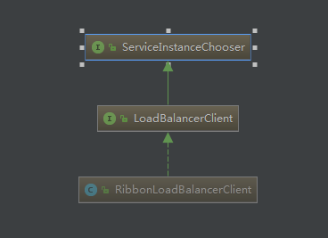
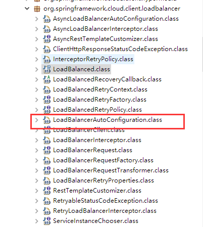
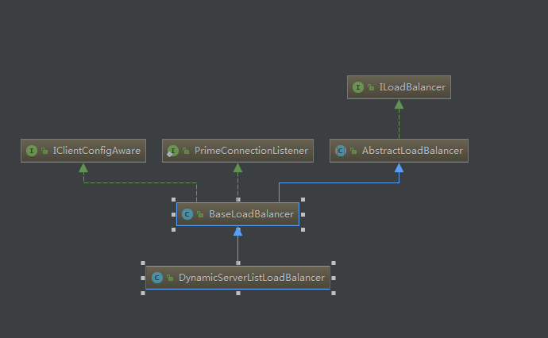
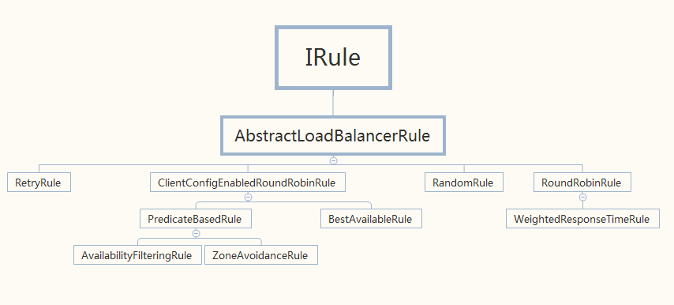
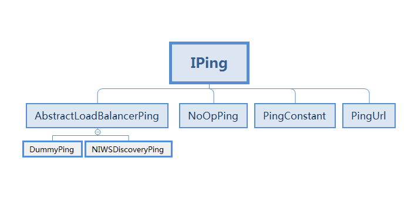

Ribbon 是 Netflix 公司开源的一个负载均衡项目。可以在 Zuul 中使用 Ribbon 做负载均衡，也可以和 Feign 结合使用。在 Spring Cloud 开发中使用的最多的可能就是 RestTemplate 和 Ribbon。代码可能如下：

```java
@Configuration
public class RibbonConfig {
    @Bean
    @LoadBalanced
    public RestTemplate restTemplate() {
        return new RestTemplate();
    }
}
```

使用 RestTemplate 消费服务接口的代码可能是这样的：

```java
@Service
public class RibbonService {
    @Autowired
    private RestTemplate restTemplate;

    public String hi(String name) {
        return restTemplate.getForObject("http://eureka-client/hi?name="+name,String.class);
    }
}
```

RestTemplate 在 Spring 中就已经存在了，查看以上的代码可以发现 RestTemplate Bean 上有一个 @LoadBalanced 注解，这个注解标记在 RestTemplate 上，让负载均衡客户端 LoadBalancerClient 来配置它。

## 负载均衡初始化

spring-cloud-commons 包中定义了 **LoadBalancerClient** 接口，它是 Ribbon 中一个非常重要的组件。继承结构如下：



### LoadBalancerAutoConfiguration

而在 spring-cloud-commons 中相同的包下面，可以看到 LoadBalancerAutoConfiguration，看类名就能看出来这是一个自动配置类，会在启动时自动加载其中的配置：




**LoadBalancerAutoConfiguration**

```java
@Configuration
@ConditionalOnClass(RestTemplate.class)
@ConditionalOnBean(LoadBalancerClient.class)
@EnableConfigurationProperties(LoadBalancerRetryProperties.class)
public class LoadBalancerAutoConfiguration {
    // 省略代码。。。主要是对 LoadBalancerInterceptor 和 RetryLoadBalancerInterCeptor 的等进行配置，这里我们看类上的注解@ConditionalOnBean和@ConditionalOnClass
}
```

可以看到该自动配置类上有注解 `@ConditionalOnBean(LoadBalancerClient.class)` 和 `@ConditionalOnClass(RestTemplate.class)`，也就是说此类的生效条件是：

> 1、当前工程中要有 RestTemplate 类
>
> 2、在 Spring 的 IOC 容器中必须要有 LoadBalancerClient 的实现 Bean

然后我们看到 `org.springframework.cloud.netflix.ribbon` 这个包，其中有一个 `RibbonAutoConfiguration.java` 类（继承于 LoadBalancerClient）。查看到其中配置的 Bean，我们可以发现，只要引入了这个包，就一定会创建一个 RibbonLoadBalancerClient 实例对象加入到 IOC 容器中，并且触发 **LoadBalancerAutoConfiguration** 配置。

```java
@Configuration
@Conditional(RibbonAutoConfiguration.RibbonClassesConditions.class)
@RibbonClients
@AutoConfigureAfter(
        name = "org.springframework.cloud.netflix.eureka.EurekaClientAutoConfiguration")
@AutoConfigureBefore({ LoadBalancerAutoConfiguration.class,
        AsyncLoadBalancerAutoConfiguration.class })
@EnableConfigurationProperties({ RibbonEagerLoadProperties.class,
        ServerIntrospectorProperties.class })
public class RibbonAutoConfiguration {
    // 省略。。。
    @Bean
    @ConditionalOnMissingBean(LoadBalancerClient.class)
    public LoadBalancerClient loadBalancerClient() {
        return new RibbonLoadBalancerClient(springClientFactory());
    }
    // 省略。。。
}
```

我们再看回 LoadBalancerAutoConfiguration，该自动化配置类，主要做了几个配置：

1、维护了一个被 @LoadBalanced 注解修饰的 **RestTemplate 对象列表**

```java
@Configuration
@ConditionalOnClass(RestTemplate.class)
@ConditionalOnBean(LoadBalancerClient.class)
@EnableConfigurationProperties(LoadBalancerRetryProperties.class)
public class LoadBalancerAutoConfiguration {

    @LoadBalanced
    @Autowired(required = false)
    private List<RestTemplate> restTemplates = Collections.emptyList();
    // ...
}
```

2、为每个对象通过调用 RestTemplateCustomizer 添加了一个 `LoadBalancerInterceptor` 和 `RetryLoadBalancerInterceptor` 拦截器。他们都是 ClientHttpRequestInterceptor 接口的实现类，`ClientHttpRequestInterceptor` 是 `RestTemplate` 的请求拦截器。

```java
@Bean
public SmartInitializingSingleton loadBalancedRestTemplateInitializerDeprecated(
        final ObjectProvider<List<RestTemplateCustomizer>> restTemplateCustomizers) {
    return () -> restTemplateCustomizers.ifAvailable(customizers -> {
        for (RestTemplate restTemplate : LoadBalancerAutoConfiguration.this.restTemplates) {
            for (RestTemplateCustomizer customizer : customizers) {
                customizer.customize(restTemplate);
            }
        }
    });
}
```

### 拦截器配置

#### LoadBalancerInterceptor 拦截器

```java
// LoadBalancerAutoconfiguration.java
@Configuration
@ConditionalOnMissingClass("org.springframework.retry.support.RetryTemplate")
static class LoadBalancerInterceptorConfig {

    @Bean
    public LoadBalancerInterceptor ribbonInterceptor(
            LoadBalancerClient loadBalancerClient,
            LoadBalancerRequestFactory requestFactory) {
        return new LoadBalancerInterceptor(loadBalancerClient, requestFactory);
    }

    @Bean
    @ConditionalOnMissingBean
    public RestTemplateCustomizer restTemplateCustomizer(
            final LoadBalancerInterceptor loadBalancerInterceptor) {
        return restTemplate -> {
            // 此处可见 LoadBalancerInterceptor 是 ClientHttpRequestInterceptor 的实现类
            List<ClientHttpRequestInterceptor> list = new ArrayList<>(
                    restTemplate.getInterceptors());
            list.add(loadBalancerInterceptor);
            restTemplate.setInterceptors(list);
        };
    }
}
```

#### RetryLoadBalancerInterceptor 拦截器

```java
@Configuration
@ConditionalOnClass(RetryTemplate.class)
public static class RetryInterceptorAutoConfiguration {

    @Bean
    @ConditionalOnMissingBean
    public RetryLoadBalancerInterceptor ribbonInterceptor(
            LoadBalancerClient loadBalancerClient,
            LoadBalancerRetryProperties properties,
            LoadBalancerRequestFactory requestFactory,
            LoadBalancedRetryFactory loadBalancedRetryFactory) {
        return new RetryLoadBalancerInterceptor(loadBalancerClient, properties,
                requestFactory, loadBalancedRetryFactory);
    }

    @Bean
    @ConditionalOnMissingBean
    public RestTemplateCustomizer restTemplateCustomizer(
            final RetryLoadBalancerInterceptor loadBalancerInterceptor) {
        return restTemplate -> {
            // RetryLoadBalancerInterceptor 也是 ClientHttpRequestInterceptor 的实现类
            List<ClientHttpRequestInterceptor> list = new ArrayList<>(
                    restTemplate.getInterceptors());
            list.add(loadBalancerInterceptor);
            restTemplate.setInterceptors(list);
        };
    }

}
```

由此可见，在程序启动的时候，如果环境中引入了相应的依赖，则会在初始化时对负载均衡器进行配置，实现的方式则是为被 @LoadBalanced 注解修饰的 RestTemplate 对象添加负载均衡拦截器。

## LoadBalancerClient 源码分析

首先我们先跟进到上文提到的拦截器(LoadBalancerInterceptor)中，可以发现，在拦截方法（intercept）中，最终是调用了 LoadBalancerClient 的 execute 方法。

```java
public class LoadBalancerInterceptor implements ClientHttpRequestInterceptor {

    private LoadBalancerClient loadBalancer;

    // ...

    @Override
    public ClientHttpResponse intercept(final HttpRequest request, final byte[] body,
            final ClientHttpRequestExecution execution) throws IOException {
        final URI originalUri = request.getURI();
        String serviceName = originalUri.getHost();
        Assert.state(serviceName != null,
                "Request URI does not contain a valid hostname: " + originalUri);
        return this.loadBalancer.execute(serviceName,
                this.requestFactory.createRequest(request, body, execution));
    }
}
```

**LoadBalancerClient** 接口中有三个方法：

```java
public interface LoadBalancerClient extends ServiceInstanceChooser {
    <T> T execute(String serviceId, LoadBalancerRequest<T> request) throws IOException;
    // 使用 LoadBalancer 的 ServiceInstance，对其执行请求，返回结果
    <T> T execute(String serviceId, ServiceInstance serviceInstance, LoadBalancerRequest<T> request) throws IOException;
    // 构造一个包含主机和端口的真正的 url
    // http://serviceId/path/... --> http://host:port/path/...
    URI reconstructURI(ServiceInstance instance, URI original);
}
```

其父类 ServiceInstanceChooser 中的方法：

```java
public interface ServiceInstanceChooser {
    ServiceInstance choose(String serviceId); // 通过 serviceId 选择服务
}
```

从继承关系里，LoadBalancerClient 的实现类就是 RibbonLoadBalancerClient 类了。

```java
// RibbonLoadBalancerClient.java
public <T> T execute(String serviceId, LoadBalancerRequest<T> request, Object hint)
        throws IOException {
    // 通过服务名获取到负载均衡器，ILoadBalancer 实现类为 DynamicServerListLoadBalancer，下文会提到
    ILoadBalancer loadBalancer = getLoadBalancer(serviceId);
    // 通过调用负载均衡器的 chooseServer 方法获取到服务器
    Server server = getServer(loadBalancer, hint);
    if (server == null) {
        throw new IllegalStateException("No instances available for " + serviceId);
    }
    RibbonServer ribbonServer = new RibbonServer(serviceId, server,
            isSecure(server, serviceId),
            serverIntrospector(serviceId).getMetadata(server));

    return execute(serviceId, ribbonServer, request);
}
@Override
public <T> T execute(String serviceId, ServiceInstance serviceInstance,
        LoadBalancerRequest<T> request) throws IOException {
    Server server = null;
    if (serviceInstance instanceof RibbonServer) {
        server = ((RibbonServer) serviceInstance).getServer();
    }
    if (server == null) {
        throw new IllegalStateException("No instances available for " + serviceId);
    }

    RibbonLoadBalancerContext context = this.clientFactory
            .getLoadBalancerContext(serviceId);
    RibbonStatsRecorder statsRecorder = new RibbonStatsRecorder(context, server);

    try {
        T returnVal = request.apply(serviceInstance);
        statsRecorder.recordStats(returnVal);
        return returnVal;
    }
    // catch IOException and rethrow so RestTemplate behaves correctly
    catch (IOException ex) {
        statsRecorder.recordStats(ex);
        throw ex;
    }
    catch (Exception ex) {
        statsRecorder.recordStats(ex);
        ReflectionUtils.rethrowRuntimeException(ex);
    }
    return null;
}
```

RibbonLoadBalancerClient 在 `execute` 中调用 `getServer` 方法来获取 Server 对象，跟踪源码可以看到，最终是通过 ILoadBalancer 的 `chooseServer` 去选择服务实例。

```java
// RibbonLoadBalancerClient.java
protected Server getServer(String serviceId) {
    // 通过 SpringClientFactory 获取 LoadBalancer 对象
    // 内部是通过反射，用构造方法构造一个实例对象
    return getServer(getLoadBalancer(serviceId), null);
}

protected Server getServer(ILoadBalancer loadBalancer) {
    return getServer(loadBalancer, null);
}

protected Server getServer(ILoadBalancer loadBalancer, Object hint) {
    if (loadBalancer == null) {
        return null;
    }
    // Use 'default' on a null hint, or just pass it on?
    // 通过 ILoadBalancer 的 chooseServer 方法获取 Server 对象
    return loadBalancer.chooseServer(hint != null ? hint : "default");
}
```


```java
public interface ILoadBalancer {
    // 添加一个 Server 集合
    public void addServers(List<Server> newServers);
    // 根据 key 获取 Server
    public Server chooseServer(Object key);
    // 标记某个服务下线
    public void markServerDown(Server server);
    // 获取可用的 Server 集合
    public List<Server> getReachableServers();
    // 获取所有的 Server集合
    public List<Server> getAllServers();
}
```

## DynamicServerListLoadBalancer

跟踪源码后，我们可以找到 ILoadBalancer 的继承结构如下，DynamicServerListLoadBalancer 继承了 ILoadBalancer，也就是说我们可以通过跟踪这个类来搞清楚 Ribbon 是如何实现负载均衡的。



### 成员介绍

查看 DynamicServerListLoadBalancer，BaseLoadBalancer，ILoadBalancer 这三个类，配置了 IClientConfig，IRule，IPing，ServerList，ServerListFilter 和 ILoadBalancer，在 BaseLoadBalancer 中，默认进行了以下配置：

- IClientConfig ribbonClientConfig：DefaultClientConfigImpl 配置（用于客户端的负载均衡配置）
- IRule ribbonRule：默认路由策略为 RoundRobinRule
- IPing ribbonPing：DummyPing
- ServerList ribbonServerList：ConfigurationBasedServerList
- ServerListFilter ribbonServerListFilter：ZonePreferenceServerListFilter
- ILoadBalancer ribbonLoadBalancer：ZoneAwareLoadBalancer

### IRule

IRule 有很多默认的实现类，都通过不同的算法来处理负载均衡，Ribbon 中实现的 IRule 又以下几种：




**IRule 实现类**

- BestAvailableRule：选择最小请求数
- ClientConfigEnabledRoundRobinRule：轮询
- RandomRule：随机选择 Server
- RoundRobinRule：轮询
- WeightedResponseTimeRule：根据响应时间分配一个权重 weight，weight越低，被选择的可能性就越低
- ZoneAvoidanceRule：根据 Server 的 Zone 区域和可用性轮询选择

### IPing

IPing 的实现类又 PingUrl，PingConstant，NoOpPing，DummyPing 和 NIWSDiscoveryPing。IPing 接口中有一个 `isAlive` 方法。

```java
public boolean isAlive(Server Server);
```

通过向 Server 发送 ping 信号，来判断 Server 是否可用




**IPing 实现类**

- PingUrl 真实的去ping 某个url，判断其是否alive
- PingConstant 固定返回某服务是否可用，默认返回true，即可用
- NoOpPing 不去ping,直接返回true,即可用。
- DummyPing 直接返回true，并实现了initWithNiwsConfig方法。
- NIWSDiscoveryPing，根据DiscoveryEnabledServer的InstanceInfo的InstanceStatus去判断，如果为InstanceStatus.UP，则为可用，否则不可用。

### ServerList

ServerList 是定义了获取所有的 Server 的注册列表信息的接口。

```java
public interface ServerList<T extends Server> {
    public List<T> getInitialListOfServers();
    public List<T> getUpdatedListOfServers();
}
```

其实现类是 `DiscoveryEnabledNIWSServerList`。

### ServerListFilter

ServerListFilter 可根据配置过滤或者根据特性动态获取符合条件的 Server 列表。该类也是一个接口

```java
public interface ServerListFilter<T extends Server> {
    public List<T> getFilteredListOfServers(List<T> servers);
}
```

## 源码分析

在 SpringClientFactory 中获取 LoadBalancer 的方法中，我们能看到获取实例的方法是通过反射获取到实现类的含有 IClientConfig 参数的构造方法来构造实例对象。

```java
// SpringClientFactory.java
static <C> C instantiateWithConfig(AnnotationConfigApplicationContext context,
        Class<C> clazz, IClientConfig config) {
    C result = null;
    try {
        // 获取到 ILoadBalancer 实现类的构造方法
        Constructor<C> constructor = clazz.getConstructor(IClientConfig.class);
        // 通过构造方法构造实例对象
        result = constructor.newInstance(config);
    }
    catch (Throwable e) {
        // Ignored
    }
    // ...
    return result;
}
```

### DynamicServerListLoadBalancer 构造方法

DynamicServerListLoadBalancer 中的构造方法中调用了一个方法 - `initWithNiwsConfig()`。

```java
// DynamicServerListLoadBalancer.java
public DynamicServerListLoadBalancer(IClientConfig clientConfig) {
    initWithNiwsConfig(clientConfig);
}
public initWithNiwsConfig(IClientConfig clientConfig) {
    try {
        super.initWithNiwsConfig(clientConfig);
        // 获取 ServerList 的 classname
        String niwsServerListClassname = clientConfig.getPropertyAsString(CommonClientConfigKey.NIWSServerListClassName, DefaultClientConfigImpl.DEFAULT_SERVER_LIST_CLASS);
        // 构造 ServerList
        ServerList<T> niwsServerListImpl = (ServerList<T>) ClientFactory.instantiateInstanceWithClientConfig(niwsServerListClassName, clientConfig);
        // 如果该 ServerList 是 AbstractServerList 的子类，则获取并设置过滤器
        if (niwsServerListImpl instanceof AbstractServerList) {
            AbstractServerListFilter<T> niwsFilter = ((AbstractServerList) niwsServerListImpl).getFilterImpl(clientConfig);
            niwsFilter.setLoadBalancerStats(getLoadBalancerStats());
            this.filter = niwsFilter;
        }
        // 获取 ServerListUpdater 的 classname
        String serverListUpdaterClassName = clientConfig.getPropertyAsString(
            CommonClientConfigKey.ServerListUpdaterClassname,
            DefaultClientConfigImpl.DEFAULT_SERVER_LIST_UPDATER_CLASS
        );

        // 通过 classname 构造 ServerListUpdater 设置到 serverListUpdater 成员属性中
        this.serverListUpdater = (ServerListUpdater) ClientFactory
            .instantiateInstanceWithClientConfig(serverListUpdaterClassName, clientConfig);
        // 执行剩下的初始化操作
        restOfInit(clientConfig);
    }
}
```

### restOfInit 执行剩下的初始化操作

```java
// DynamicServerListLoadBalancer.java
void restOfInit(IClientConfig clientConfig) {
    boolean primeConnection = this.isEnablePrimingConnections();
    // 将这个关闭来避免 BaseLoadBalancer.setServerList() 中重复的异步启动
    this.setEnablePrimingConnections(false);
    enableAndInitLearnNewServersFeature();

    updateListOfServers(); // 用来获取所有的 Server 
    if (primeConnection && this.getPrimeConnections() != null) {
        this.getPrimeConnections().primeConnections(getReachableServers());
    }
    this.setEnablePrimingConnections(primeConnection);
    LOGGER.info("DynamicServerListLoadBalancer for client {} initialized: {}", clientConfig.getClientName(), this.toString());
}
```

上面源码中的 `updateListOfServers()` 最终是通过 serverListImpl.getUpdatedListOfServers() 来获取所有的服务列表的：

```java
// DynamicServerListLoadBalancer.java
@VisibleForTesting
public void updateListOfServers() {
    List<T> servers = new ArrayList<T>();
    if (serverListImpl != null) {
        servers = serverListImpl.getUpdatedListOfServers();
        LOGGER.debug("List of Servers for {} obtained from Discovery client: {}", 
                     getIdentifier(), servers);
        if (filter != null) {
            // 如果配置了过滤器，则将符合条件的 server 筛选出来
            servers = filter.getFilteredListOfServers(servers);
            LOGGER.debug("Filtered List of Servers for {} obtained from Discovery client: {}", getIdentifier(), servers);
        }
    }
    updateAllServerList(servers);
}
```

其中 serverListImpl 是 ServerList 的实现类 - DiscoveryEnabledNIWSServerList。而 `getUpdatedListOfServers()` 的具体实现为：

```java
// DiscoveryEnabledNIWSServerList.java
@Override
public List<DiscoveryEnabledServer> getInitialListOfServers() {
    return obtainServersViaDiscovery();
}
public List<DiscoveryEnabledServer> getUpdatedListOfServers() {
    return obtainServersViaDiscovery();
}
```

### obtainServersViaDiscovery

```java
// DiscoveryEnabledNIWSServerList.java
private List<DiscoveryEnabledServer> obtainServersViaDiscovery() {
    List<DiscoveryEnabledServer> serverList = new ArrayList<DiscoveryEnabledServer>();

    if (eurekaClientProvider == null || eurekaClientProvider.get() == null) {
        logger.warn("EurekaClient has not been initialized yet, returning an empty list");
        return new ArrayList<DiscoveryEnabledServer>();
    }

    EurekaClient eurekaClient = eurekaClientProvider.get();
    if (vipAddresses!=null){
        for (String vipAddress : vipAddresses.split(",")) {
            // if targetRegion is null, it will be interpreted as the same region of client
            List<InstanceInfo> listOfInstanceInfo = eurekaClient.getInstancesByVipAddress(vipAddress, isSecure, targetRegion);
            for (InstanceInfo ii : listOfInstanceInfo) {
                if (ii.getStatus().equals(InstanceStatus.UP)) {

                    if(shouldUseOverridePort){
                        if(logger.isDebugEnabled()){
                            logger.debug("Overriding port on client name: " + clientName + " to " + overridePort);
                        }

                        // copy is necessary since the InstanceInfo builder just uses the original reference,
                        // and we don't want to corrupt the global eureka copy of the object which may be
                        // used by other clients in our system
                        InstanceInfo copy = new InstanceInfo(ii);

                        if(isSecure){
                            ii = new InstanceInfo.Builder(copy).setSecurePort(overridePort).build();
                        }else{
                            ii = new InstanceInfo.Builder(copy).setPort(overridePort).build();
                        }
                    }

                    DiscoveryEnabledServer des = new DiscoveryEnabledServer(ii, isSecure, shouldUseIpAddr);
                    des.setZone(DiscoveryClient.getZone(ii));
                    serverList.add(des);
                }
            }
            if (serverList.size()>0 && prioritizeVipAddressBasedServers){
                break; // if the current vipAddress has servers, we dont use subsequent vipAddress based servers
            }
        }
    }
    return serverList;
}
```

看到这里，可以知道负载均衡器 Ribbon 是通过 Eureka Client 来获取注册列表信息，然后通过配置的路由规则 IRule 来路由。但是它从 Eureka Client 获取注册信息的时间间隔是多久呢？

### 定时任务更新服务器列表和状态

在构造 DynamicServerListLoadBalancer 的构造方法中的第一行是调用父类中的 `initWithNiwsConfig` 方法。

```java
// DynamicServerListLoadBalancer.java
public initWithNiwsConfig(IClientConfig clientConfig) {
    try {
        super.initWithNiwsConfig(clientConfig);
    }
    // ...
}
```

于是我们跟踪到 BaseLoadBalancer 的 initWithNiwsConfig 方法中：

```java
// BaseLoadBalancer.java
@Override
public void initWithNiwsConfig(IClientConfig clientConfig) {
    try {
        initWithNiwsConfig(clientConfig, ClientFactory::instantiateInstanceWithClientConfig);
    } catch (Exception e) {
        throw new RuntimeException("Error initializing load balancer", e);
    }
}
@Override
public void initWithNiwsConfig(IClientConfig clientConfig, Factory factory) {
    S// ...
    try {
        // ...
        initWithConfig(clientConfig, rule, ping, stats);
    } catch (Exception e) {
        throw new RuntimeException("Error initializing load balancer", e);
    }
}

void initWithConfig(IClientConfig clientConfig, IRule rule, IPing ping, LoadBalancerStats stats) {
    // ...

    setPingInterval(pingIntervalTime);
    setMaxTotalPingTime(maxTotalPingTime);

    // cross associate with each other
    // i.e. Rule,Ping meet your container LB
    // LB, these are your Ping and Rule guys ...
    setRule(rule);
    setPing(ping);

    // ...

}
```

以上只保留了关键代码。调用到 initWithConfig 方法中，会执行 `setPingInterval(pingIntervalTime)` 方法。

```java
public void setPingInterval(int pingIntervalSeconds) {
    if (pingIntervalSeconds < 1) {
        return;
    }

    this.pingIntervalSeconds = pingIntervalSeconds;
    if (logger.isDebugEnabled()) {
        logger.debug("LoadBalancer [{}]:  pingIntervalSeconds set to {}",
            name, this.pingIntervalSeconds);
    }
    setupPingTask(); // since ping data changed
}
```

其中开启了一个定时任务：`setupPingTask()` 。在该方法内部使用 ShutdownEnabledTimer 初始化了一个定时器，并且设置每10秒调用 PingTask 任务。

```java
// BaseLoadBalancer.java
// 定时任务
void setupPingTask() {
    if (canSkipPing()) {
        return;
    }
    if (lbTimer != null) {
        lbTimer.cancel();
    }
    lbTimer = new ShutdownEnabledTimer("NFLoadBalancer-PingTimer-" + name,
            true);
    lbTimer.schedule(new PingTask(), 0, pingIntervalSeconds * 1000); // 默认10秒执行一次
    forceQuickPing();
}
```

PingTask 是 BaseLoadBalancer 的内部类，根据 IPingStrategy 策略来发送 ping 请求获取和更新服务器列表，默认策略是 SerialPingStrategy。在 PingTask 的 run 方法中，执行了另一个内部类 Pinger 的 runPinger 方法。

```java
// BaseLoadBalancer.java
// 内部类 PingTask
class PingTask extends TimerTask {
    public void run() {
        try {
            new Pinger(pingStrategy).runPinger();
        } catch (Exception e) {
            logger.error("LoadBalancer [{}]: Error pinging", name, e);
        }
    }
}
// 内部类 Pinger
class Pinger {

    private final IPingStrategy pingerStrategy;

    public Pinger(IPingStrategy pingerStrategy) {
        this.pingerStrategy = pingerStrategy;
    }

    public void runPinger() throws Exception {
        // 用 CAS 设置 pingInProgress 为 true，代表正在执行 Ping 任务。
        // 如果设置失败，则表示有线程正在执行 Ping 任务，这里就不再执行
        if (!pingInProgress.compareAndSet(false, true)) { 
            return; // Ping in progress - nothing to do
        }

        // we are "in" - we get to Ping

        Server[] allServers = null;
        boolean[] results = null;

        Lock allLock = null;
        Lock upLock = null;

        try {
            /*
             * The readLock should be free unless an addServer operation is
             * going on...
             */
            // 读锁应该是空闲状态，除了 addServer 操作正在执行。
            allLock = allServerLock.readLock();
            // 加读锁，避免其他线程修改 serverList
            allLock.lock();
            allServers = allServerList.toArray(new Server[allServerList.size()]);
            // 解锁
            allLock.unlock();

            int numCandidates = allServers.length;
            // 向每个服务器发送 ping 请求，得到一个布尔值的结果集（服务器是否存活 - 能否请求成功）
            results = pingerStrategy.pingServers(ping, allServers);

            final List<Server> newUpList = new ArrayList<Server>();
            final List<Server> changedServers = new ArrayList<Server>();

            // 遍历当前所有Server
            for (int i = 0; i < numCandidates; i++) {
                // 获取第 i 个 Server 是当前否为存活状态（UP）
                boolean isAlive = results[i];
                Server svr = allServers[i];
                // 获取 ping 之前的服务器状态
                boolean oldIsAlive = svr.isAlive();

                // 将该服务器状态改为当前获取到的状态
                svr.setAlive(isAlive);

                if (oldIsAlive != isAlive) { // 如果之前状态与当前获取的状态不一致
                    // 加入到状态更改过的服务器列表中
                    changedServers.add(svr);
                    // 输出日志：当前服务器状态修改
                    logger.debug("LoadBalancer [{}]:  Server [{}] status changed to {}", 
                        name, svr.getId(), (isAlive ? "ALIVE" : "DEAD"));
                }

                if (isAlive) {
                    // 如果获取到的当前状态为 true（存活UP状态）
                    // 则将该服务器加入到 newUpList 中，用于后面更新至存活服务器列表
                    newUpList.add(svr);
                }
            }
            // 更新存活服务器列表，需要加写锁，避免并发问题
            upLock = upServerLock.writeLock();
            upLock.lock();
            upServerList = newUpList;
            upLock.unlock();

            // 通知服务器状态修改
            notifyServerStatusChangeListener(changedServers);
        } finally {
            pingInProgress.set(false);
        }
    }
}
```

该定时任务的大致流程为：

1、首先将用 CAS 来修改 pingInProgress （AtomicBoolean 对象），如果修改不成功，则表示当前有其他线程正在发送 ping 请求，并且还没有执行完毕，所以当前操作可以不再执行。

2、加读锁获取当前服务列表。

3、通过 IPingStrategy 向每个服务器发送 ping 请求，得到一个布尔值的结果集。

3、遍历之前获取到的 Server List，判断服务状态是否有变化，并更新服务列表。（其中状态更改的服务器将会加入到 changedServers 列表中，ping 请求后依然存活的服务会加入到 newUpList 中）

4、最后加写锁更新 UP 状态的服务器列表，并**通知服务状态改变**。(有兴趣的话，此处可以查看一下ServerStatusChangeListener 的实现类是哪个，再看具体做了什么操作)

5、全部执行完成后，将 pingInProgress 改为 false。

## 总结

由此可见，Ribbon的负载均衡，主要是通过 LoadBalancerClient 来实现的，而 Load’BalancerClient 又将具体实现交给了 ILoadBalancer 来处理，ILoadBalancer 通过配置 IRule、IPing 等信息，向 Eureka 获取服务注册列表，并且在初始化时开启一个定时任务，10s 一次向 EurekaClient 发送 ping 请求，来判断服务的可用性，如果服务的可用性发生改变或者服务数量与之前的不一致，则更新当前服务器列表或重新拉取。最后 ILoadBalancer 获取到这些服务列表之后，便可以根据 IRule 来进行负载均衡。

而 RestTemplate 被 @LoadBalanced 注解后，能够实现负载均衡，主要是通过给 RestTemplate 添加拦截器，在请求前通过拦截器（负载均衡）获取到真正的请求地址，最后进行服务调用。

## Ref

[Ribbon 源码](https://github.com/Netflix/ribbon.git)

[Spring Cloud Commons 源码](https://github.com/spring-cloud/spring-cloud-commons.git)

[Spring Cloud Netflix 源码](https://github.com/spring-cloud/spring-cloud-netflix.git)

[Spring Cloud Netflix Ribbon 官方文档](https://cloud.spring.io/spring-cloud-static/spring-cloud-netflix/2.1.3.RELEASE/single/spring-cloud-netflix.html#spring-cloud-ribbon)

[Spring Cloud Ribbon踩坑记录及原理解析](https://github.com/aCoder2013/blog/issues/29)

[Ribbon原理分析 - Spring For All](http://www.spring4all.com/article/230)
